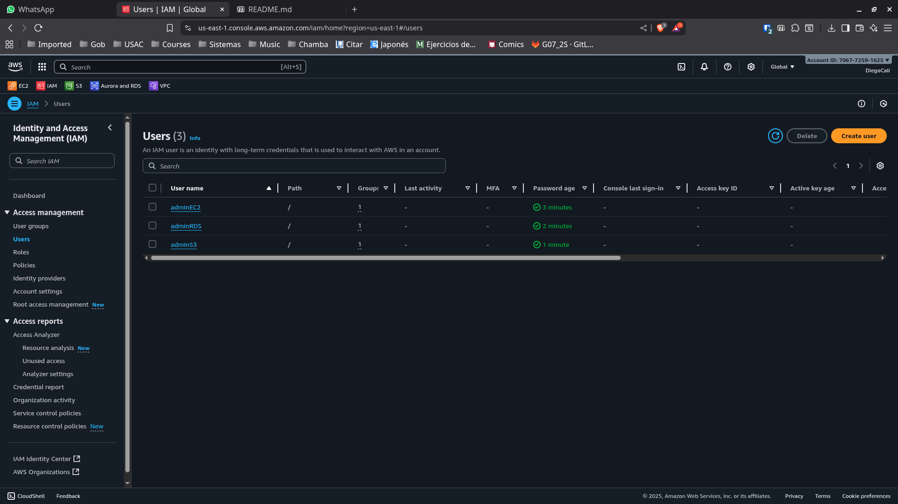
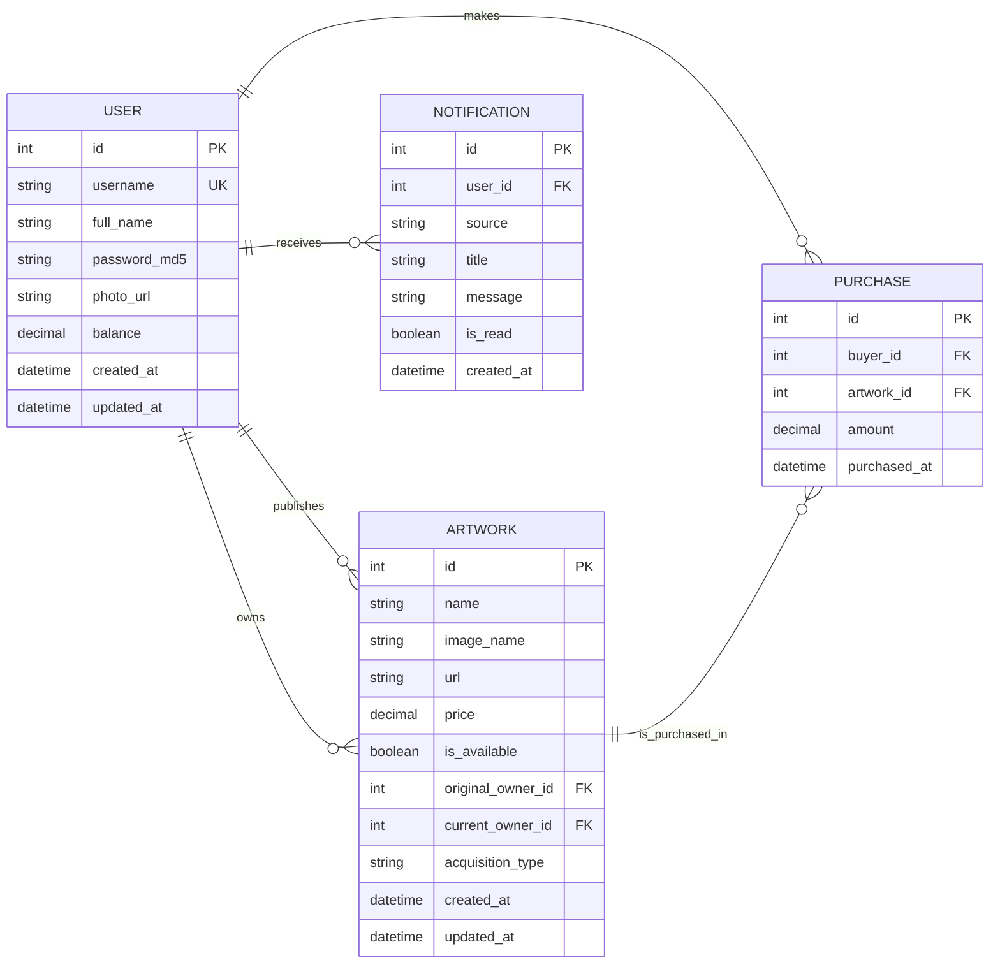

# Proyectos de laboratorio grupo 8

## Usuarios IAM utilizados:

## Documentacion practica 1

## Backend

El backend está desarrollado en **Node.js + Express** y el backend2 en **Python 3**, organizado en rutas separadas para usuarios, autenticación, obras y compras.  
Todas las respuestas se entregan en formato **JSON**, salvo endpoints de imágenes/redirecciones.

---

## Healthcheck

### `GET /health`

- Verifica que la API está en funcionamiento.  
- **Respuesta:** `{ ok: true }`

---

## Autenticación (`/auth`)

### `POST /auth/register`

- **Body (form-data o JSON):**
  - `username` (string, requerido)
  - `full_name` (string, requerido)
  - `password` (string, requerido)
  - `image` (archivo opcional, foto de perfil)
- **Acciones:**
  - Crea un usuario nuevo.
  - Encripta contraseña con **MD5** (16 chars).
  - Opción de subir foto de perfil (almacenada en `Fotos_Perfil`).
- **Respuestas:**
  - `201 Created` → usuario creado
  - `409 Conflict` → usuario ya existe

---

### `POST /auth/login`

- **Body (JSON):**
  - `username` (string)
  - `password` (string)
- **Acciones:**
  - Valida credenciales contra la base de datos.
- **Respuestas:**
  - `200 OK` → retorna perfil básico `{ id, username, full_name, balance }`
  - `401 Unauthorized` → credenciales inválidas

---

## Usuarios (`/users`)

### `GET /users/:id`

- Retorna información de perfil del usuario.

### `POST /users/:id/balance`

- **Body:** `{ amount: number }`
- Recarga saldo al usuario.
- Retorna nuevo balance.

### `PUT /users/:id`

- **Body:** `{ username?, full_name?, new_password?, current_password }`
- Edita datos de perfil (requiere contraseña actual).
- Valida duplicados y cambios.

### `POST /users/:id/photo`

- **form-data:** `image` (archivo requerido)
- Sube/actualiza foto de perfil.

### `GET /users/:id/photo`

- Redirige a la URL pública de la foto de perfil.

### `GET /users/:id/notifications`

- Lista notificaciones del usuario.

### `PUT /users/:id/notifications/:notifId/read`

- Marca notificación como leída.

---

## Obras de Arte (`/artworks`)

### `GET /artworks`

- Lista obras disponibles en la galería (paginación con `limit` y `offset`).

### `GET /artworks/created?userId=...`

- Obras creadas/publicadas por un usuario.

### `GET /artworks/mine?userId=...`

- Obras adquiridas o pertenecientes al usuario.

### `POST /artworks/upload`

- **form-data:**
  - `image` (archivo requerido)
  - `userId` (int requerido)
  - `name` (string requerido)
  - `price` (decimal requerido ≥ 0)
- Publica una obra en la galería y la sube a `Fotos_Publicadas`.

---

## Compras (`/purchase`)

### `POST /purchase`

- **Body:** `{ buyerId, artworkId }`
- Ejecuta compra de obra:
  - Valida saldo suficiente.
  - Transfiere saldo entre comprador y vendedor.
  - Marca obra como no disponible.
- **Respuestas:**
  - `200 OK` → compra exitosa
  - `409 Conflict` → errores de negocio (saldo insuficiente, obra no disponible, etc.)

---

## Extras

### `GET /artworks/__debug`

- Devuelve información de configuración del almacenamiento (`local` o `s3`).
- Solo para depuración.

---

## Notas

- Todas las contraseñas se guardan en **MD5(16)**.
- Las imágenes (obras y perfiles) se guardan en **S3** o almacenamiento local (según configuración).

## Base de datos

La base de datos está diseñada para soportar una **galería de arte digital en la nube**, donde los usuarios pueden:

- Registrarse e iniciar sesión.
- Visualizar obras de arte disponibles.
- Comprar obras (si tienen saldo suficiente).
- Administrar su perfil (datos, foto de perfil, saldo).
- Revisar las obras adquiridas.

El sistema se implementa sobre **Amazon RDS**, y las imágenes no se guardan directamente en la base de datos, sino mediante **URLs de S3**.

---

### Tablas Principales

#### `usuarios`

Contiene los datos de los usuarios de la plataforma.

| Campo          | Tipo          | Restricciones                              | Descripción                           |
|----------------|--------------|---------------------------------------------|---------------------------------------|
| `id_usuario`   | INT          | PK, AUTO_INCREMENT                         | Identificador único                   |
| `usuario`      | VARCHAR(50)  | UNIQUE, NOT NULL                           | Nombre de usuario                     |
| `nombre`       | VARCHAR(100) | NOT NULL                                   | Nombre completo                       |
| `password`     | VARCHAR(255) | NOT NULL                                   | Contraseña encriptada con **MD5**     |
| `foto_perfil`  | VARCHAR(255) | NULL                                       | URL en S3 de la foto de perfil        |
| `saldo`        | DECIMAL(10,2)| DEFAULT 0                                  | Saldo disponible del usuario          |

---

#### `obras`

Registra las obras de arte disponibles en la galería.

| Campo           | Tipo          | Restricciones             | Descripción                             |
|-----------------|--------------|----------------------------|-----------------------------------------|
| `id_obra`       | INT          | PK, AUTO_INCREMENT        | Identificador único de la obra          |
| `titulo`        | VARCHAR(100) | NOT NULL                  | Título de la obra                       |
| `autor`         | VARCHAR(100) | NOT NULL                  | Autor de la obra                        |
| `anio`          | YEAR         | NOT NULL                  | Año de publicación                      |
| `url_imagen`    | VARCHAR(255) | NOT NULL                  | Ruta en S3 de la obra (`Fotos_Publicadas`) |
| `precio`        | DECIMAL(10,2)| NOT NULL                  | Precio de la obra                       |
| `disponible`    | BOOLEAN      | DEFAULT TRUE              | Disponibilidad para compra              |

---

#### `compras`

Historial de adquisiciones realizadas por los usuarios.

| Campo           | Tipo          | Restricciones      | Descripción                           |
|-----------------|--------------|--------------------|---------------------------------------|
| `id_compra`     | INT          | PK, AUTO_INCREMENT | Identificador único de la compra      |
| `id_usuario`    | INT          | FK → `usuarios`    | Usuario que realiza la compra         |
| `id_obra`       | INT          | FK → `obras`       | Obra adquirida                        |
| `fecha`         | DATETIME     | DEFAULT NOW()      | Fecha de la transacción               |
| `monto`         | DECIMAL(10,2)| NOT NULL           | Valor pagado                          |

---

### Procedimientos Almacenados (`stored_procedures.sql`)

#### `sp_registrar_usuario(usuario, nombre, password, foto)`

- Valida que no exista un usuario con el mismo nombre.
- Inserta el nuevo registro con la contraseña encriptada en **MD5**.
- Inicializa el saldo en 0.

#### `sp_login(usuario, password)`

- Valida credenciales comparando el **hash MD5**.
- Retorna los datos básicos del usuario si la autenticación es correcta.

#### `sp_adquirir_obra(id_usuario, id_obra)`

- Verifica que la obra esté disponible.
- Revisa que el usuario tenga saldo suficiente.
- Registra la compra en `compras`.
- Actualiza el saldo del usuario.
- Marca la obra como **no disponible**.

#### `sp_aumentar_saldo(id_usuario, monto)`

- Incrementa el saldo del usuario.
- Retorna el nuevo saldo.

---

### Triggers (`triggers.sql`)

#### `trg_validar_saldo`

- Antes de insertar en `compras`, verifica que el usuario tenga el saldo suficiente.
- Lanza error si no cumple.

#### `trg_actualizar_saldo`

- Después de una compra, descuenta el saldo del usuario automáticamente.

#### `trg_bloquear_usuario_duplicado`

- Evita que se inserte un usuario con nombre repetido.

---

### Diagrama Entidad-Relación (ER)

---

### Consideraciones

- Las contraseñas **no se almacenan en texto plano**, se usa **MD5**.
- Las imágenes no están en la BD, solo la **URL en S3**.
- Los procedimientos y triggers aseguran la **integridad de las transacciones**.
- Todas las funciones principales de la aplicación (login, registro, compra, perfil) dependen de esta estructura.
