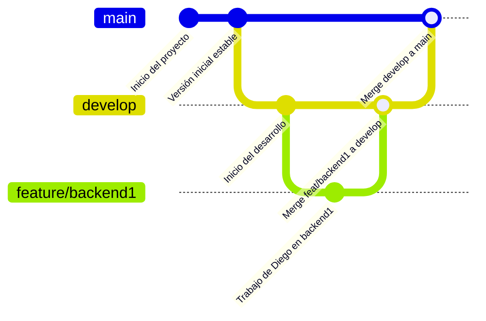

# Instrucciones Generales

## Repartición de trabajo:
- Alvaro: base de datos
- Josué: backend 1 (nodejs)
- Pamela: backend 2 (python/flask)
- María: frontend
- Diego: arquitectura cloud

## Flujo de trabajo:
Utilizarémos el método de Gitflow para manejar ramas. Pasos para el manejo de ramas:
> Las ramas main y develop NO reciben commits.
1. Estando en la rama develop hacer pull por cualquier cambio que se haya hecho previamente.
2. Hacer una rama para lo que les tocó, ejemplo: `feature/base-de-datos`.
3. Trabajar, hacer pruebas aisladas y hacer commits en esta nueva rama.
4. Al finalizar hacer un último commit de la rama: `feature: base de datos`, y hacer push al repositorio remoto.
5. Debe asesorarse que la rama ya existe en el repositorio remoto, revisar las ramas en la página de github.
6. Cambiar a la rama develop.
7. Hacer pull en la rama develop.
8. Hacer merge de la rama que ya tiene terminada con la rama develop, ejemplo: `Merge feature/base-de-datos into develop`.
9. Hacer push de la rama develop.

**Representación gráfica:**

>[!IMPORTANT]
> Generar la documentación de cada parte y ponerla en el README.md. Una plantilla ya se encuentra ahí

# Itinerario

1. Primero se debe generar la base de datos, sus tablas, sus procedimientos y su documentació (hacer las pruebas pertienentes).
2. Luego se debe implementar el backend 1 (nodejs) y la documentación de lo que reciben y retornan sus endpoints.
3. Después se debe implementar el backend 2 (python/flask) y la documentación de lo que reciben y retornan sus endpoints.
4. Luego se debe implementar el frontend (html, css, js) y la documentación de como levantar la aplicación y cómo funciona su interfaz.
5. Por último, se debe realizar pruebas de integración y asegurarse de que todos los componentes funcionen correctamente juntos, para luego desplegar la aplicación en un entorno de producción en aws.